# Awesome CLI Prompts — Theme Gallery

> A curated collection of beautiful, feature-rich command-line prompt themes for Bash, Zsh, Fish, and Starship. Browse the gallery below, then install any theme with a single command.

```bash
# Install any theme
acp install <id>
```

## Table of Contents

- [Bash](#bash)
  - [Corporate Clean](#bash-corporate-clean)
  - [DevOps K8s](#bash-devops-k8s)
  - [Exit Code](#bash-exit-code)
  - [Git Aware](#bash-git-aware)
  - [Git Focused](#bash-git-focused)
  - [Hacker Matrix](#bash-hacker-matrix)
  - [Lambda Minimal](#bash-lambda-minimal)
  - [Minimal Clean](#bash-minimal-clean)
  - [Neon Glow](#bash-neon-glow)
  - [Pastel Dream](#bash-pastel-dream)
  - [Powerline No-Plugin](#bash-powerline-no-plugin)
  - [Rainbow Pride](#bash-rainbow-pride)
  - [Retro Green](#bash-retro-green)
- [Zsh](#zsh)
  - [Async Git](#zsh-async-git)
  - [Cloud DevOps](#zsh-cloud-devops)
  - [Docker Aware](#zsh-docker-aware)
  - [Kubernetes Context](#zsh-kubernetes-context)
  - [OMZ Compatible](#zsh-omz-compatible)
  - [Powerlevel10k Lite](#zsh-powerlevel10k-lite)
  - [Pure Inspired](#zsh-pure-inspired)
  - [Right Prompt](#zsh-right-prompt)
  - [Transient Prompt](#zsh-transient-prompt)
  - [Two Line Time](#zsh-two-line-time)
- [Fish](#fish)
  - [Corporate Fish](#fish-corporate-fish)
  - [Fun Emoji](#fish-fun-emoji)
  - [Informative Fish](#fish-informative-fish)
  - [Minimal Fish](#fish-minimal-fish)
  - [Powerline Fish](#fish-powerline-fish)
- [Starship](#starship)
  - [Data Science Starship](#starship-data-science-starship)
  - [DevOps Starship](#starship-devops-starship)
  - [Full Featured Starship](#starship-full-featured-starship)
  - [Minimal Starship](#starship-minimal-starship)
  - [Writer Starship](#starship-writer-starship)

---

## Bash

Classic and universally available. These prompts work with plain Bash (4.x+).

### Corporate Clean

Professional, no-nonsense prompt for corporate environments

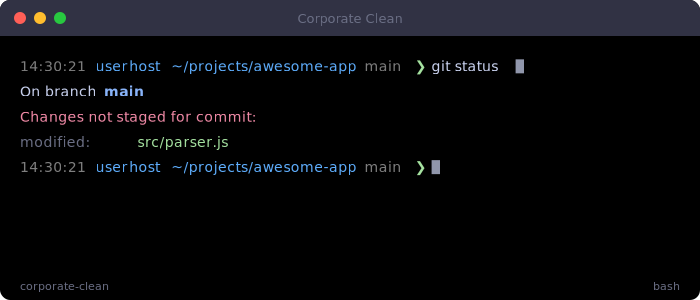

| | |
|---|---|
| **Author** | mongsill6 |
| **Version** | 1.0.0 |
| **Shell** | Bash |
| **ID** | `corporate-clean` |
| **Tags** | `corporate` `professional` `clean` `business` |
| **Requires** | `git` |

**Install**

```bash
acp install corporate-clean
```

---

### DevOps K8s

DevOps-oriented prompt with Kubernetes context and Docker info

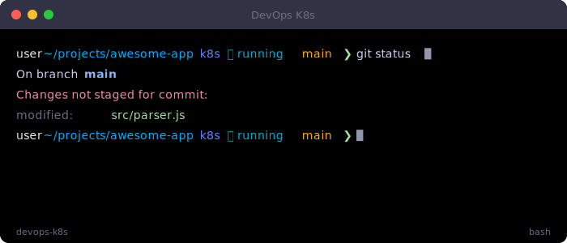

| | |
|---|---|
| **Author** | mongsill6 |
| **Version** | 1.0.0 |
| **Shell** | Bash |
| **ID** | `devops-k8s` |
| **Tags** | `devops` `kubernetes` `docker` `cloud` |
| **Requires** | `kubectl`, `docker`, `git` |

**Install**

```bash
acp install devops-k8s
```

---

### Exit Code

Shows last command exit code with color-coded status indicator for debugging

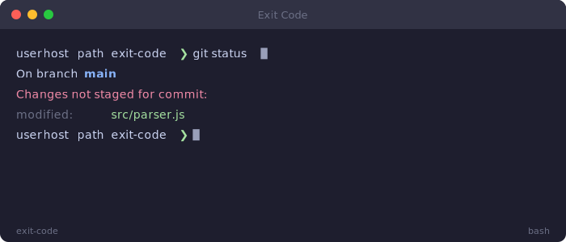

| | |
|---|---|
| **Author** | mongsill6 |
| **Version** | 1.0.0 |
| **Shell** | Bash |
| **ID** | `exit-code` |
| **Tags** | `exit-code` `status` `debug` `developer` `error-handling` |

**Install**

```bash
acp install exit-code
```

---

### Git Aware

A prompt that displays current git branch and dirty/clean status with color indicators

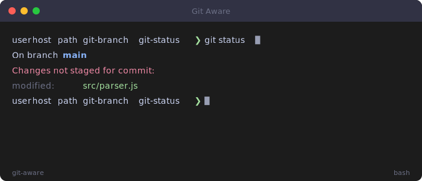

| | |
|---|---|
| **Author** | mongsill6 |
| **Version** | 1.0.0 |
| **Shell** | Bash |
| **ID** | `git-aware` |
| **Tags** | `git` `branch` `status` `developer` `vcs` |
| **Requires** | `git` |

**Install**

```bash
acp install git-aware
```

---

### Git Focused

Developer prompt with detailed git information

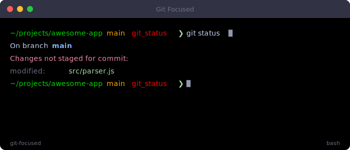

| | |
|---|---|
| **Author** | mongsill6 |
| **Version** | 1.0.0 |
| **Shell** | Bash |
| **ID** | `git-focused` |
| **Tags** | `git` `developer` `informative` |
| **Requires** | `git` |

**Install**

```bash
acp install git-focused
```

---

### Hacker Matrix

Matrix-inspired green-on-black hacker aesthetic with system info

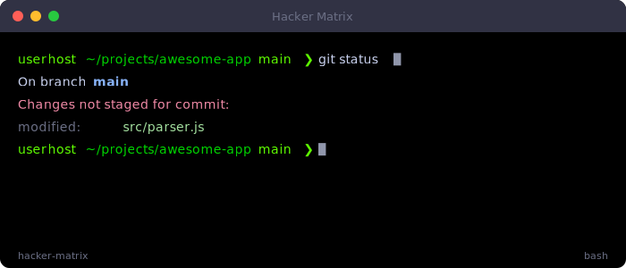

| | |
|---|---|
| **Author** | mongsill6 |
| **Version** | 1.0.0 |
| **Shell** | Bash |
| **ID** | `hacker-matrix` |
| **Tags** | `hacker` `matrix` `green` `cybersecurity` |
| **Requires** | `git` |

**Install**

```bash
acp install hacker-matrix
```

---

### Lambda Minimal

Ultra-minimal prompt inspired by lambda calculus notation

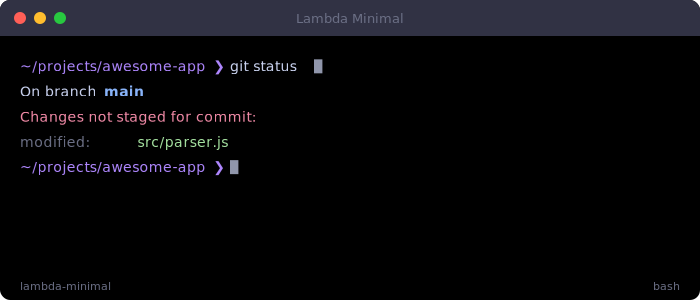

| | |
|---|---|
| **Author** | mongsill6 |
| **Version** | 1.0.0 |
| **Shell** | Bash |
| **ID** | `lambda-minimal` |
| **Tags** | `minimal` `lambda` `elegant` `clean` |

**Install**

```bash
acp install lambda-minimal
```

---

### Minimal Clean

A clean, minimal prompt with directory and arrow

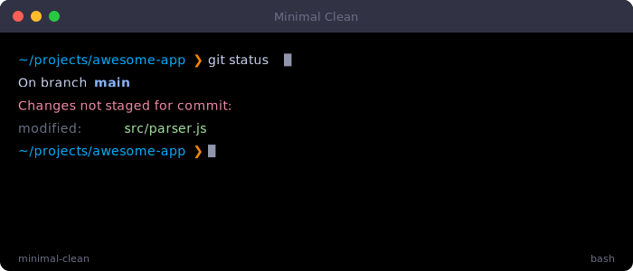

| | |
|---|---|
| **Author** | mongsill6 |
| **Version** | 1.0.0 |
| **Shell** | Bash |
| **ID** | `minimal-clean` |
| **Tags** | `minimal` `clean` `beginner-friendly` |

**Install**

```bash
acp install minimal-clean
```

---

### Neon Glow

Vibrant neon colors with a cyberpunk aesthetic

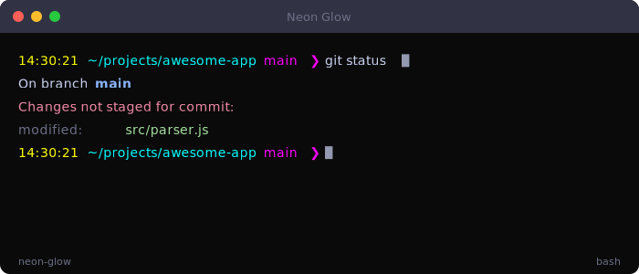

| | |
|---|---|
| **Author** | mongsill6 |
| **Version** | 1.0.0 |
| **Shell** | Bash |
| **ID** | `neon-glow` |
| **Tags** | `neon` `cyberpunk` `colorful` `fun` |
| **Requires** | `git` |

**Install**

```bash
acp install neon-glow
```

---

### Pastel Dream

Soft pastel colors for a gentle, easy-on-the-eyes prompt

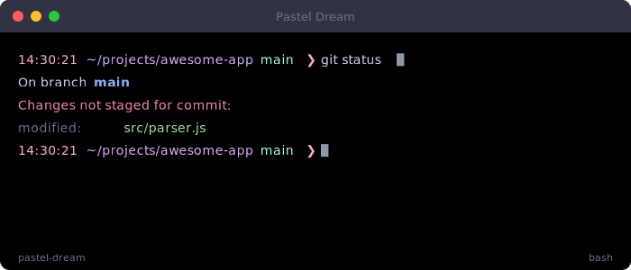

| | |
|---|---|
| **Author** | mongsill6 |
| **Version** | 1.0.0 |
| **Shell** | Bash |
| **ID** | `pastel-dream` |
| **Tags** | `pastel` `soft` `gentle` `aesthetic` |
| **Requires** | `git` |

**Install**

```bash
acp install pastel-dream
```

---

### Powerline No-Plugin

Powerline-style prompt without any plugins, pure bash


| | |
|---|---|
| **Author** | mongsill6 |
| **Version** | 1.0.0 |
| **Shell** | Bash |
| **ID** | `powerline-noplug` |
| **Tags** | `powerline` `no-plugin` `colorful` |
| **Requires** | [Nerd Font](https://www.nerdfonts.com/), `git` |

**Install**

```bash
acp install powerline-noplug
```

---

### Rainbow Pride

Colorful rainbow prompt celebrating diversity


| | |
|---|---|
| **Author** | mongsill6 |
| **Version** | 1.0.0 |
| **Shell** | Bash |
| **ID** | `rainbow-pride` |
| **Tags** | `rainbow` `pride` `colorful` `fun` `inclusive` |

**Install**

```bash
acp install rainbow-pride
```

---

### Retro Green

Classic green-on-black retro terminal aesthetic

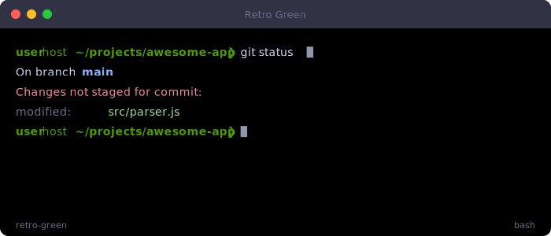

| | |
|---|---|
| **Author** | mongsill6 |
| **Version** | 1.0.0 |
| **Shell** | Bash |
| **ID** | `retro-green` |
| **Tags** | `retro` `green` `classic` `nostalgia` |

**Install**

```bash
acp install retro-green
```

---

## Zsh

Featureful prompts for Zsh, taking advantage of PROMPT_SUBST and hooks.

### Async Git

Fast prompt with async git status using zsh/zpty

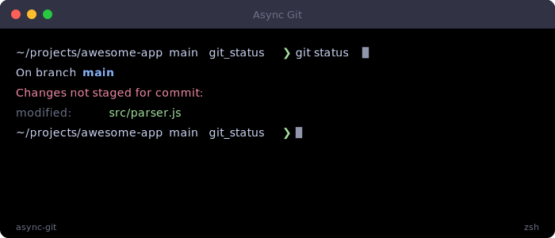

| | |
|---|---|
| **Author** | mongsill6 |
| **Version** | 1.0.0 |
| **Shell** | Zsh |
| **ID** | `async-git` |
| **Tags** | `async` `git` `performance` |
| **Requires** | `git` |

**Install**

```bash
acp install async-git
```

---

### Cloud DevOps

All-in-one DevOps prompt with cloud provider, k8s, docker, and git info


| | |
|---|---|
| **Author** | mongsill6 |
| **Version** | 1.0.0 |
| **Shell** | Zsh |
| **ID** | `cloud-devops` |
| **Tags** | `devops` `cloud` `kubernetes` `docker` `git` `feature-rich` |
| **Requires** | `git`, `kubectl`, `docker` |

**Install**

```bash
acp install cloud-devops
```

---

### Docker Aware

Prompt that shows Docker container status and active environment

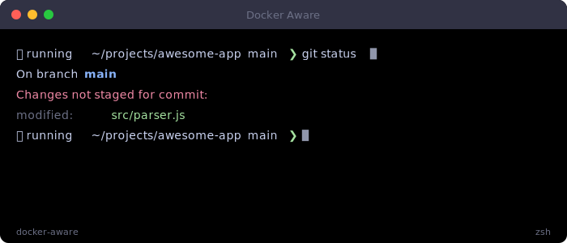

| | |
|---|---|
| **Author** | mongsill6 |
| **Version** | 1.0.0 |
| **Shell** | Zsh |
| **ID** | `docker-aware` |
| **Tags** | `devops` `docker` `git` `containers` |
| **Requires** | `git`, `docker` |

**Install**

```bash
acp install docker-aware
```

---

### Kubernetes Context

DevOps prompt showing Kubernetes context and namespace

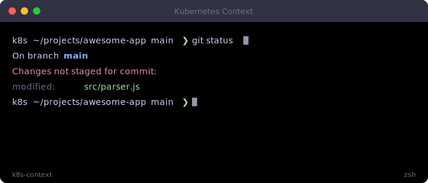

| | |
|---|---|
| **Author** | mongsill6 |
| **Version** | 1.0.0 |
| **Shell** | Zsh |
| **ID** | `k8s-context` |
| **Tags** | `devops` `kubernetes` `k8s` `git` |
| **Requires** | `git`, `kubectl` |

**Install**

```bash
acp install k8s-context
```

---

### OMZ Compatible

Oh My Zsh compatible theme with user, host, directory, and git

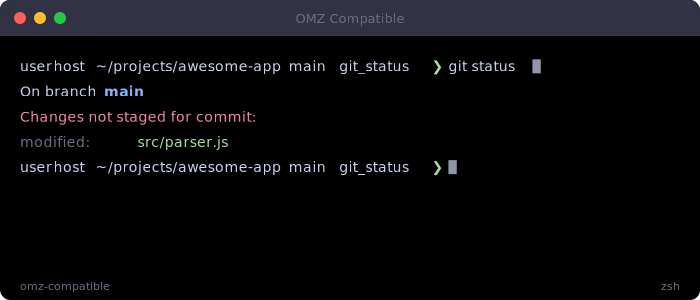

| | |
|---|---|
| **Author** | mongsill6 |
| **Version** | 1.0.0 |
| **Shell** | Zsh |
| **ID** | `omz-compatible` |
| **Tags** | `omz` `traditional` `git` |
| **Requires** | `git` |

**Install**

```bash
acp install omz-compatible
```

---

### Powerlevel10k Lite

Lightweight p10k-inspired prompt with powerline segments

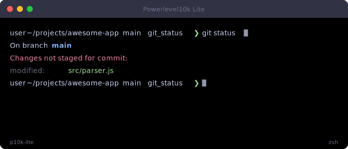

| | |
|---|---|
| **Author** | mongsill6 |
| **Version** | 1.0.0 |
| **Shell** | Zsh |
| **ID** | `p10k-lite` |
| **Tags** | `powerline` `nerd-font` `git` `feature-rich` |
| **Requires** | [Nerd Font](https://www.nerdfonts.com/), `git` |

**Install**

```bash
acp install p10k-lite
```

---

### Pure Inspired

Clean async prompt inspired by sindresorhus/pure with git info

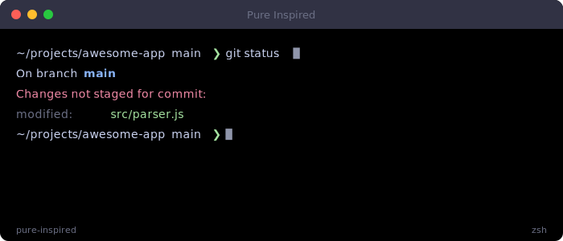

| | |
|---|---|
| **Author** | mongsill6 |
| **Version** | 1.0.0 |
| **Shell** | Zsh |
| **ID** | `pure-inspired` |
| **Tags** | `minimal` `async` `git` |
| **Requires** | `git` |

**Install**

```bash
acp install pure-inspired
```

---

### Right Prompt

Minimal left prompt with rich right-side information display

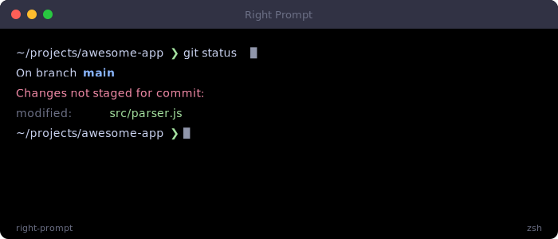

| | |
|---|---|
| **Author** | mongsill6 |
| **Version** | 1.0.0 |
| **Shell** | Zsh |
| **ID** | `right-prompt` |
| **Tags** | `minimal` `right-prompt` `git` `time` |
| **Requires** | `git` |

**Install**

```bash
acp install right-prompt
```

---

### Transient Prompt

Rich prompt that collapses to minimal after command execution


| | |
|---|---|
| **Author** | mongsill6 |
| **Version** | 1.0.0 |
| **Shell** | Zsh |
| **ID** | `transient-prompt` |
| **Tags** | `transient` `minimal` `clean` `git` |
| **Requires** | `git` |

**Install**

```bash
acp install transient-prompt
```

---

### Two Line Time

Two-line prompt with timestamp, directory, and git on separate lines

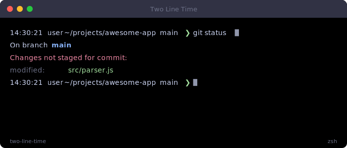

| | |
|---|---|
| **Author** | mongsill6 |
| **Version** | 1.0.0 |
| **Shell** | Zsh |
| **ID** | `two-line-time` |
| **Tags** | `two-line` `time` `git` `informative` |
| **Requires** | `git` |

**Install**

```bash
acp install two-line-time
```

---

## Fish

Beautiful prompts for the Friendly Interactive Shell.

### Corporate Fish

Professional corporate prompt for Fish shell

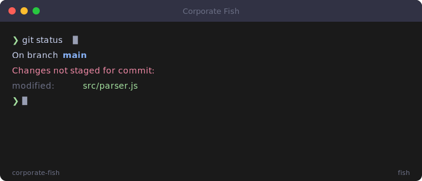

| | |
|---|---|
| **Author** | mongsill6 |
| **Version** | 1.0.0 |
| **Shell** | Fish |
| **ID** | `corporate-fish` |
| **Tags** | `corporate` `professional` `clean` |

**Install**

```bash
acp install corporate-fish
```

---

### Fun Emoji

Playful emoji-decorated prompt for Fish shell

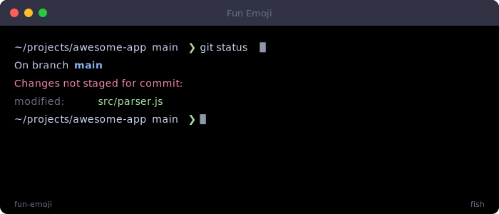

| | |
|---|---|
| **Author** | mongsill6 |
| **Version** | 1.0.0 |
| **Shell** | Fish |
| **ID** | `fun-emoji` |
| **Tags** | `fun` `emoji` `creative` |
| **Requires** | `git` |

**Install**

```bash
acp install fun-emoji
```

---

### Informative Fish

Information-rich prompt showing system details for Fish

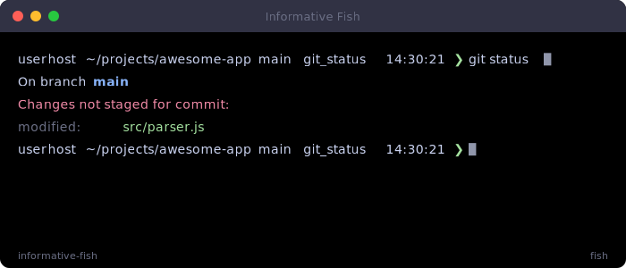

| | |
|---|---|
| **Author** | mongsill6 |
| **Version** | 1.0.0 |
| **Shell** | Fish |
| **ID** | `informative-fish` |
| **Tags** | `informative` `git` `time` `detailed` |
| **Requires** | `git` |

**Install**

```bash
acp install informative-fish
```

---

### Minimal Fish

Clean minimal prompt for Fish shell


| | |
|---|---|
| **Author** | mongsill6 |
| **Version** | 1.0.0 |
| **Shell** | Fish |
| **ID** | `minimal-fish` |
| **Tags** | `minimal` `clean` `beginner-friendly` |

**Install**

```bash
acp install minimal-fish
```

---

### Powerline Fish

Powerline-style prompt with rich segments for Fish

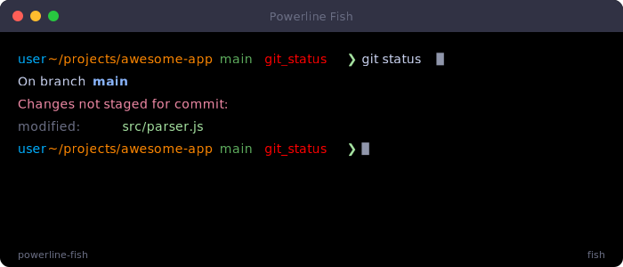

| | |
|---|---|
| **Author** | mongsill6 |
| **Version** | 1.0.0 |
| **Shell** | Fish |
| **ID** | `powerline-fish` |
| **Tags** | `powerline` `git` `modern` |
| **Requires** | [Nerd Font](https://www.nerdfonts.com/), `git` |

**Install**

```bash
acp install powerline-fish
```

---

## Starship

Cross-shell prompts configured via TOML/YAML for use with Starship.

### Data Science Starship

Data science workflow Starship preset with Python and env support


| | |
|---|---|
| **Author** | mongsill6 |
| **Version** | 1.0.0 |
| **Shell** | Starship |
| **ID** | `data-science` |
| **Tags** | `data-science` `python` `minimal` |

**Install**

```bash
acp install data-science
```

---

### DevOps Starship

DevOps-focused Starship preset with cloud and container modules optimized for cloud engineers, SREs, and infrastructure teams.

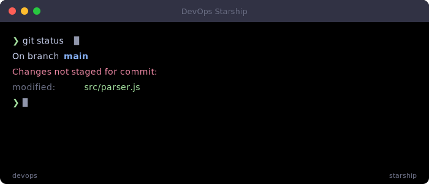

| | |
|---|---|
| **Author** | mongsill6 |
| **Version** | 1.0.0 |
| **Shell** | Starship |
| **ID** | `devops` |
| **Tags** | `devops` `kubernetes` `docker` `terraform` `cloud` `aws` `gcp` `infrastructure` |

**Install**

```bash
acp install devops
```

---

### Full Featured Starship

Comprehensive Starship preset with all major modules enabled for a feature-rich terminal experience with git integration, language support, and devops tools.


| | |
|---|---|
| **Author** | mongsill6 |
| **Version** | 1.0.0 |
| **Shell** | Starship |
| **ID** | `full-featured` |
| **Tags** | `powerline` `git` `devops` `full-featured` `languages` `monitoring` |

**Install**

```bash
acp install full-featured
```

---

### Minimal Starship

Ultra-minimal Starship preset for maximum speed and clean output

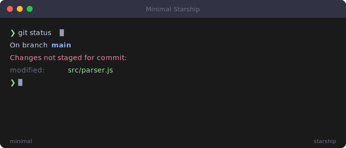

| | |
|---|---|
| **Author** | mongsill6 |
| **Version** | 1.0.0 |
| **Shell** | Starship |
| **ID** | `minimal` |
| **Tags** | `minimal` `clean` `fast` `performance` |

**Install**

```bash
acp install minimal
```

---

### Writer Starship

Distraction-free Starship preset for writers and documentation

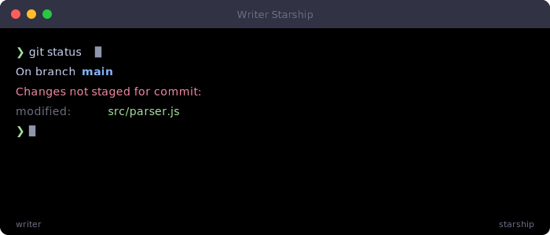

| | |
|---|---|
| **Author** | mongsill6 |
| **Version** | 1.0.0 |
| **Shell** | Starship |
| **ID** | `writer` |
| **Tags** | `minimal` `writer` `clean` `distraction-free` |

**Install**

```bash
acp install writer
```

---


<sub>
Generated automatically by `scripts/generate-gallery.js` on Fri, 27 Mar 2026 01:11:21 GMT.

To regenerate after adding or editing themes, run: `node scripts/generate-gallery.js`
</sub>
